# cicd

Build CICD with Jenkins, Docker, K8S

At the beginning, I find myself creating jenkins with docker to set up this tool cause I want to set up it on any platform I set up. 
- First of all, we need to create a network that connect any containers inside and be convenient   to set up pipeline 
```
docker network create jenkins
```
- Secondly, we need to create containers for jenkins tool and docker in docker(dind). jenkins is connected with dind to build image docker first and push to docker-registry serving for the next step 
```
## command running building jenkins image 
docker build -t jenkins_jenkins -f Dockerfile .

## command running container dind
docker run --name jenkins-docker --rm --detach \
    --privileged --network $NETWORK --net-alias docker \
    --env DOCKER_TLS_CERTDIR=/certs \
    --volume ~/build/cicd/jenkins-docker-certs:/certs/client \
    --volume ~/build/cicd/jenkins-data:/var/jenkins_home \
    --publish 2376:2376 \
    --publish 2377:2375 \
    docker:dind --storage-driver overlay2
## command running container jenkins from previous built image 
docker run --name jenkins --rm --detach --privileged \
    --network $NETWORK --env DOCKER_HOST=tcp://docker:2376 \
    --env DOCKER_CERT_PATH=/certs/client --env DOCKER_TLS_VERIFY=1 \
    --link jenkins-docker:docker \
    --publish 8081:8080 --publish 50000:50000 \
    --volume ~/build/cicd/jenkins-data:/var/jenkins_home \
    --volume ~/build/cicd/jenkins-docker-certs:/certs/client:ro \
    --volume /var/run/docker.sock:/var/run/docker.sock \
    --volume $(which docker):$(which docker) \
    jenkins_jenkins
```
- Thirdly, let’s start with setting up 
    - After jenkins started as illustration below ⇒ http://localhost:8081/login?from=%2F
    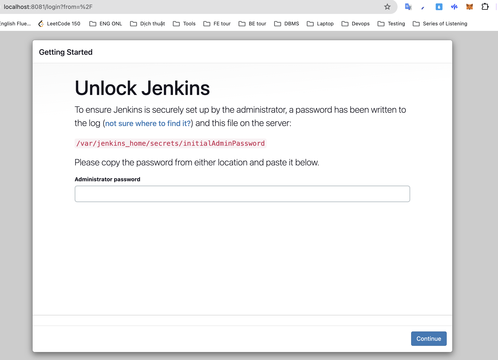
    - Perform command to get admin password and input into box ⇒ continue 
    ```
    docker exec -it jenkins cat /var/jenkins_home/secrets/initialAdminPassword
    ```
    - Press Install with Plugin
    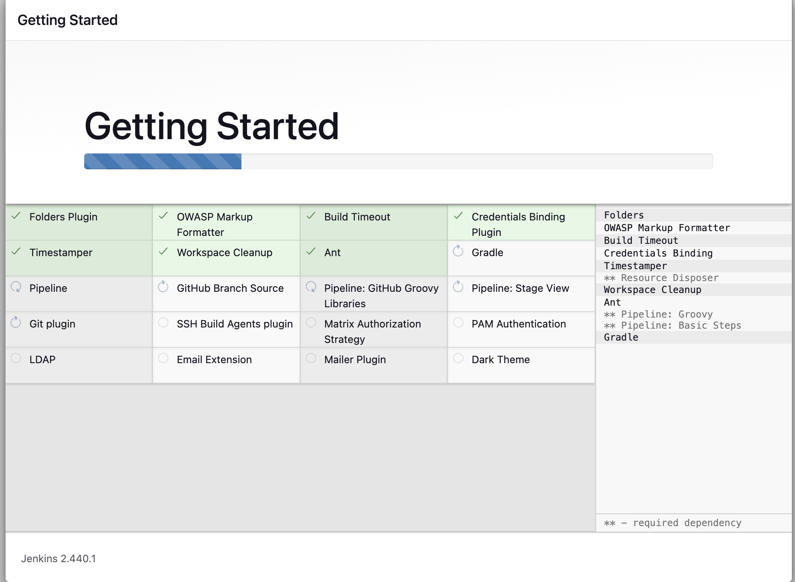
    - Fill in the form as our expected ⇒ admin for all =))))
    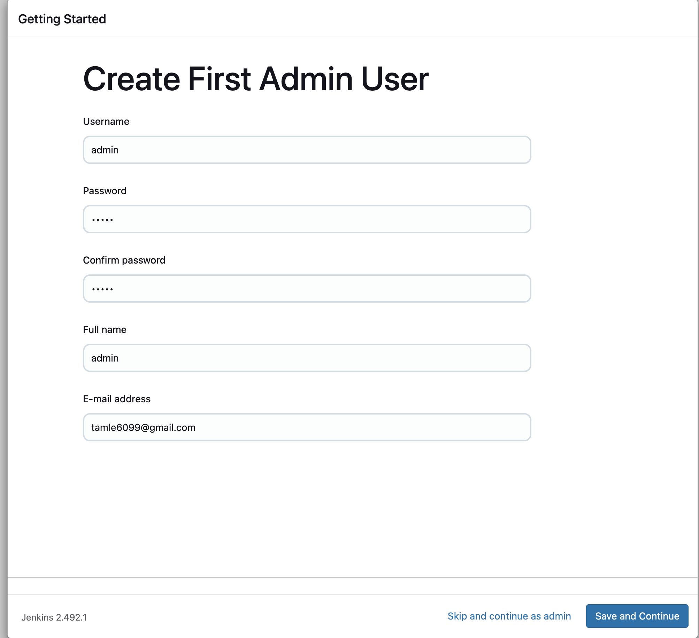
    - Consider changing localhost into my IP address to easy to connect with outside 
    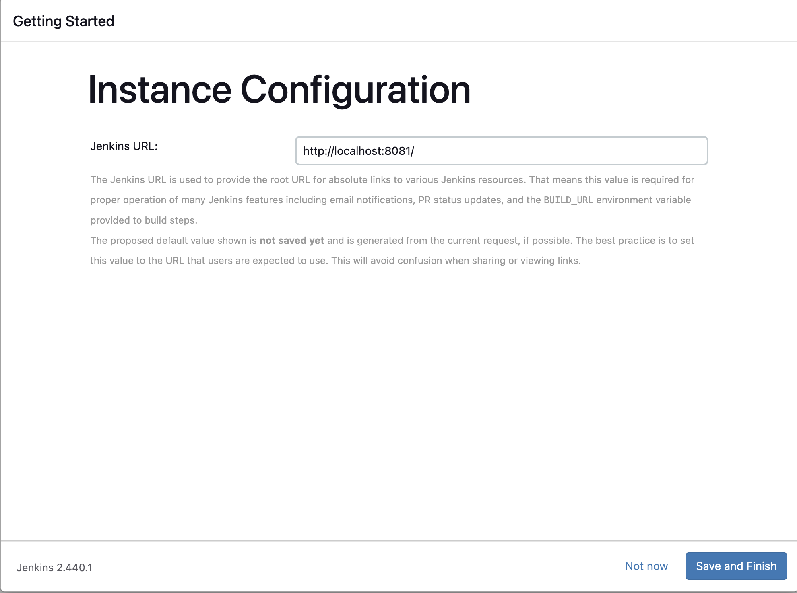

## STEPS 
We will need to setup step by step to connect to docker, k8s.
### DOCKER
Because I'm setting up at local, I must connect my jenkins to docker throughout docker in docker (dind)
```
 --volume ~/build/cicd/jenkins-data:/var/jenkins_home \
 --volume ~/build/cicd/jenkins-docker-certs:/certs/client:ro \
```
could you see this code when building docker for jenkins 
At there, we found three files including ca.pem, cert.pem, key.pem and we have to create x059 to allow for jenkins to connect local docker 
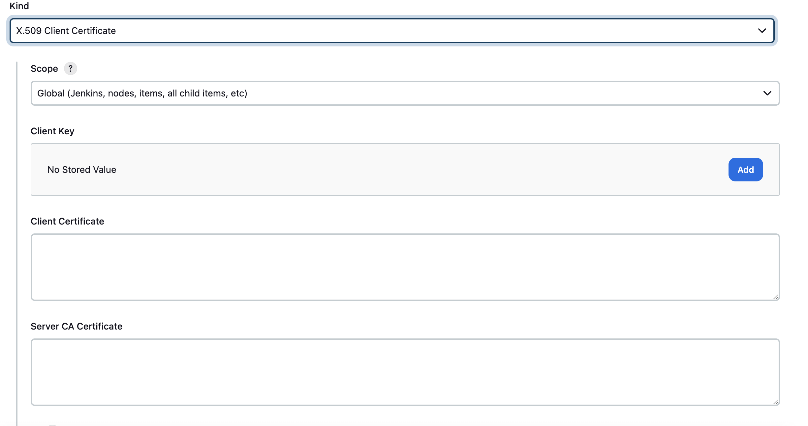
- Client Key: key.pem
- Client Certificate: cert.pem
- Server CA Certificate: ca.pem
The rest of this step is to create new cloud of docker type like that
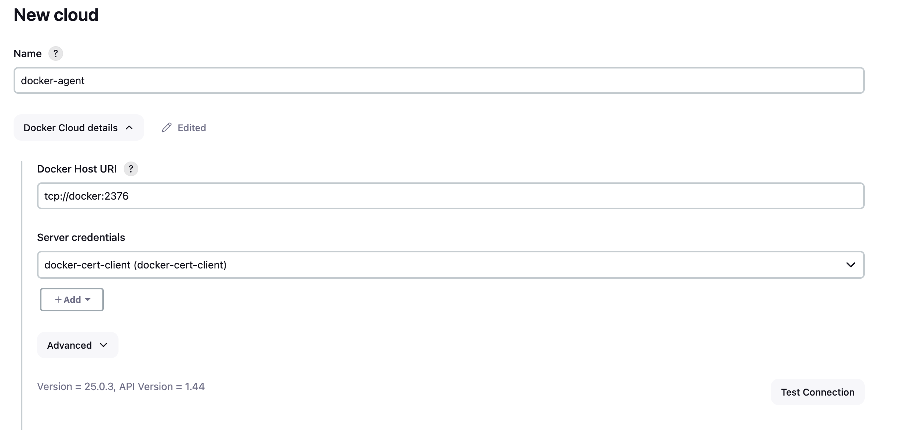
DONE!!!!
### Kubernetes
We need to find the certificate of K8S to be allowed connection to K8S from jenkins
because I'm using docker desktop, I can find it out at `~/.kube/config `
and then, we will create certificate for kubernetes like that
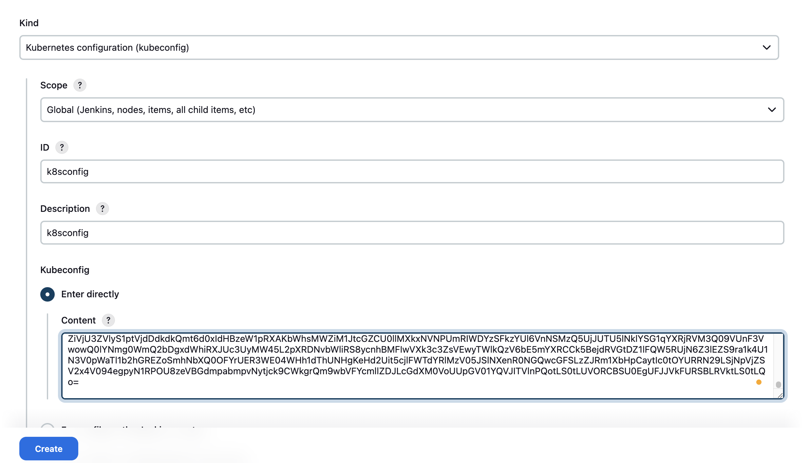
DONE!!!!
### PIPELINE
After that, we only build one pipeline for application of repo to reach the goal 
we just follow this steps at all 
the first, we will choose `new item` and click `pipeline`
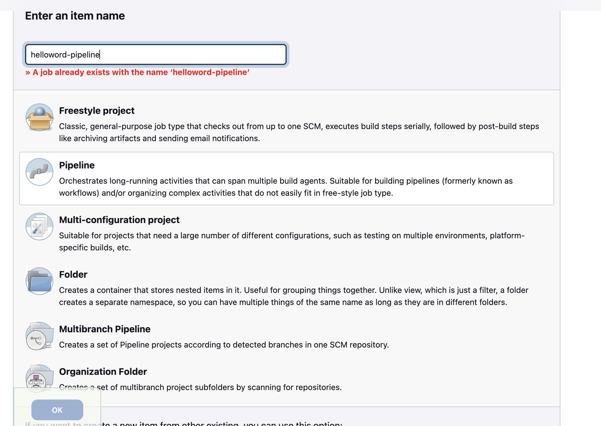
the second, we will set up for our jobs connect to github
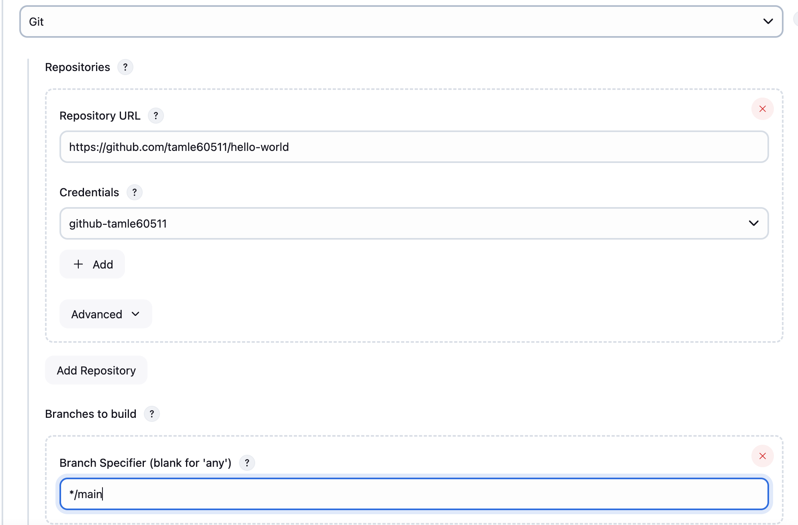
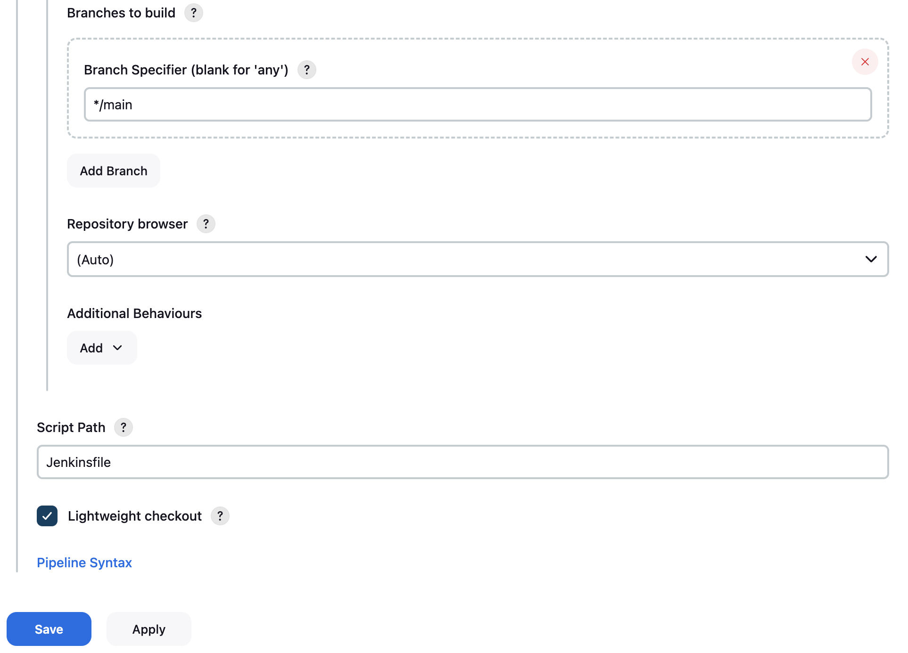

## RESULT
After all, we just await for the result as our dream
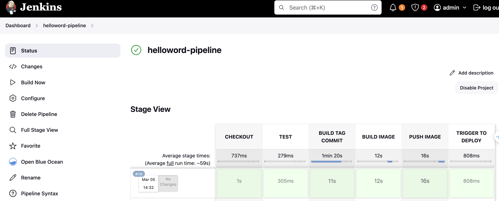